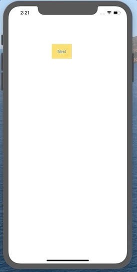
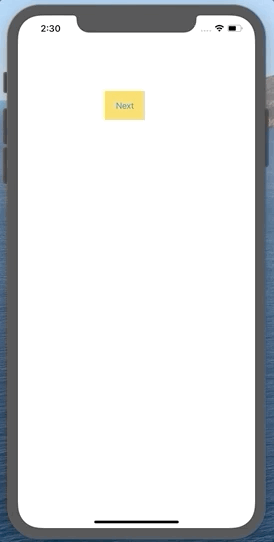

# NSViewAnim


[](https://travis-ci.org/namsoo5/NSViewAnim)

[](https://cocoapods.org/pods/NSViewAnim)

[](https://cocoapods.org/pods/NSViewAnim)

[](https://cocoapods.org/pods/NSViewAnim)


💜Enjoy Ease Of Animation!!💜


## Requirements

iOS 12+

## Installation

NSViewAnim is available through [CocoaPods](https://cocoapods.org). To install
it, simply add the following line to your Podfile:

```ruby
pod 'NSViewAnim'
```

## Usage

### ⭐️import NSViewAnim⭐️

<br>


> Chaining Animation Option

``` swif
func nextVC(){
    guard let nextVC = self.storyboard?.instantiateViewController(identifier: "Second") else {return}
    nextVC.setPresentStyle(presentMode: .custom)    // CircleAnim Require Option
          .setTransStyle(transMode: .coverVertical)
          .setTransDelegate(self)    // CircleAnim Require Option
          .done()    // Finish Chaining
}
```

<br>

<br>


> Circle Effect Animation



* Extend UIViewControllerTransitioningDelegate 
* Implement func
  * animationController(forPresented __presented__: UIViewController, presenting: UIViewController, source: UIViewController)
  * animationController(forDismissed __dismissed__: UIViewController) 

``` swift
class ViewController: UIViewControllerTransitioningDelegate {
    let circleView = NSCircleAnim()

    // presentAnim
    func animationController(forPresented presented: UIViewController, presenting: UIViewController, source: UIViewController) -> UIViewControllerAnimatedTransitioning? {
        return circleView.animState(mode: .present)
            .animStartPoint(point: self.nextButton.center)
            .animColor(color: self.nextButton.backgroundColor!)
        
    }
    
    // dismissAnim
    func animationController(forDismissed dismissed: UIViewController) -> UIViewControllerAnimatedTransitioning? {
        return circleView.animState(mode: .dismiss)
            .animStartPoint(point: self.nextButton.center)
            .animColor(color: self.nextButton.backgroundColor!)
    }
  
  	func nextVC(){
      nextVC.setPresentStyle(presentMode: .custom)  // CircleAnim Require Option
                .setTransStyle(transMode: .coverVertical)
                .setTransDelegate(self)  // CircleAnim Require Option
                .done()
    }
}
```

<br>

* NSCircleAnim
  * ❗️__Require__❗️
    * Next ViewController declare setTransDelegate and presentMode: .custom


  ``` swift
  circleView.animState()
  .animStartPoint()
  .animColor()
  .animDuration()
  .done()
  ```

* animState: present or dismiss
* animStartPoint: animation effect start position
* animColor: animation effect color
* animDuration: animation duration
* done: finish chaining


<br>

<br>


> Down Drag Dismiss



* Extend __NSDownView__
* add downViewController() or downViewController(_, degree)
* call downScrollDismissAnim()

``` swfit
class ViewController: UIViewController, NSDownView {
    func downViewControllerEvent(_ gesture: UIPanGestureRecognizer) {
        // add gesture
        downViewController(gesture)
        downViewController(gesture, degree: 1/3)
    }
    
    override func viewDidLoad() {
        super.viewDidLoad()
        
        // apply Anim
        self.downScrollDismissAnim()
        
    }
}
```

* downViewController(): add gesture recognizer
* downScrollDismissAnim(): apply gesture recognizer


<br>

<br>


## Author

namsoo5, are34@naver.com

## License

NSViewAnim is available under the MIT license. See the LICENSE file for more info.
